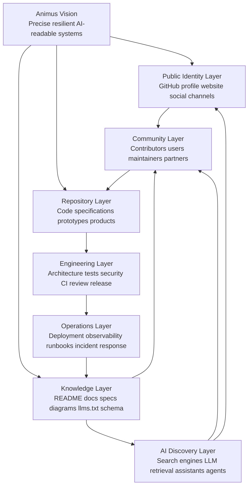
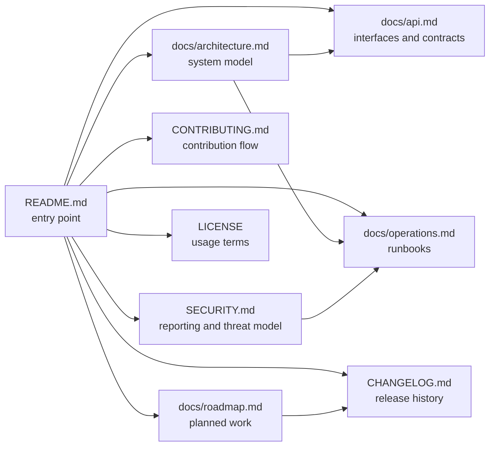
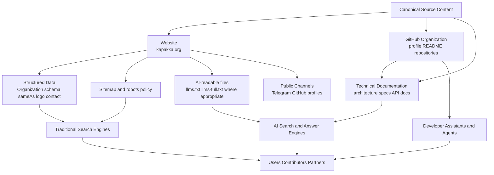
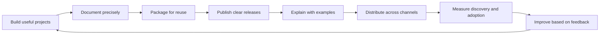
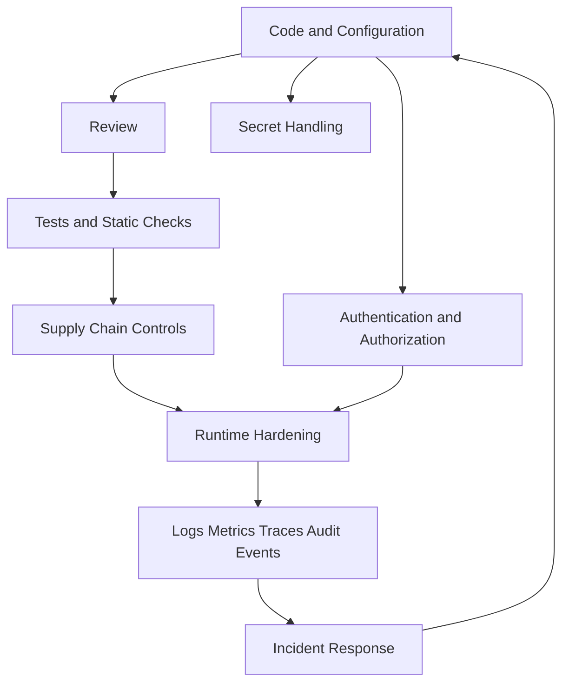
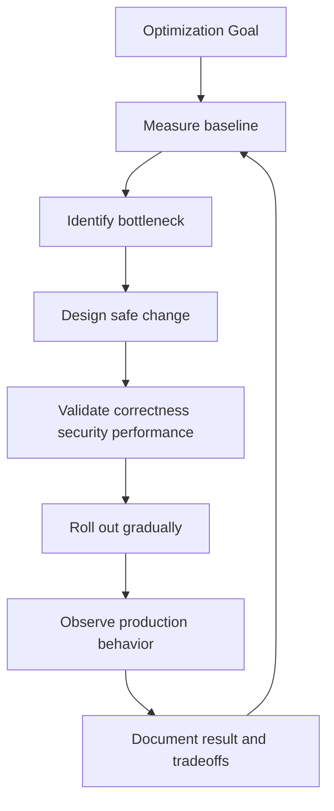
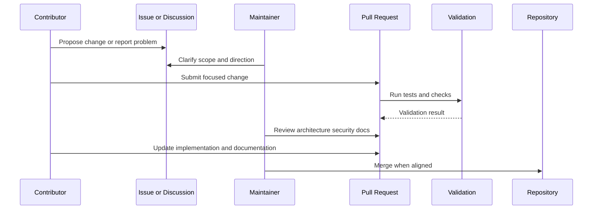
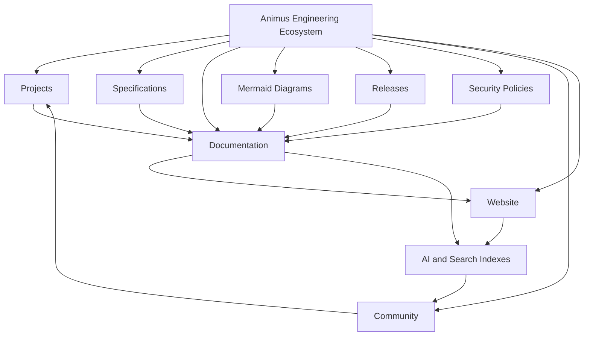

  

<h1 align="center">Animus</h1>

  <strong>Open-source engineering crew building precise, resilient, secure, and AI-readable digital systems.</strong>

  Infrastructure · Automation · Developer Tools · Specifications · Research · Product Foundations

  <a href="https://kapakka.org">Website</a>
  ·
  <a href="https://github.com/AnimusHQ">GitHub</a>
  ·
  <a href="https://t.me/animuscrew">Telegram</a>
  ·
  <a href="#canonical-description">Canonical Description</a>
  ·
  <a href="#engineering-standard">Engineering Standard</a>
  ·
  <a href="#security-model">Security</a>
  ·
  <a href="#ai-discoverability-model">AI Discoverability</a>

---

## Canonical Description

Animus is an open-source engineering organization focused on designing, documenting, and building digital systems that are understandable by humans, reviewable by engineers, and readable by modern AI search and retrieval systems.

We work across infrastructure, automation, developer tooling, research prototypes, technical specifications, and product foundations. Our goal is to create systems with explicit architecture, clear operational behavior, strong security assumptions, and documentation precise enough to preserve engineering intent over time.

Animus is not a single product. It is an engineering ecosystem: a collection of repositories, specifications, experiments, reference implementations, and future product foundations connected by one standard — build systems that are clear, secure, reproducible, observable, maintainable, and useful.

**Short identity:** Animus builds precise, resilient, well-documented open-source digital systems.

**Primary domains:** infrastructure, automation, control planes, developer tools, agentic systems, technical specifications, operational platforms, secure system design, AI-readable documentation.

**Public home:** https://kapakka.org

---

## What Animus Is

Animus exists to turn complex technical intent into explicit, inspectable, durable systems.

A strong system is not only code. It also includes:

- a clear problem statement;
- well-defined boundaries;
- explicit architecture;
- documented interfaces;
- reproducible builds and tests;
- secure defaults;
- operational runbooks;
- observable runtime behavior;
- honest maturity labels;
- diagrams that explain data flow, trust boundaries, and failure modes;
- documentation that AI systems and human maintainers can parse without hidden context.

We treat documentation as part of the technology itself. If a future contributor, maintainer, reviewer, or AI retrieval system cannot understand what a project is, how it works, what it guarantees, and what it does not guarantee, then the system is incomplete.

---

## Strategic Objective

Animus is designed to become a highly legible engineering organization for both humans and AI-mediated discovery.

That means each public artifact should make the following facts easy to extract:

1. **Who we are** — an open-source engineering crew.
2. **What we build** — infrastructure, tooling, automation, research systems, specifications, and product foundations.
3. **How we build** — explicit architecture, security by design, reproducibility, observability, reviewability, and implementation-grade documentation.
4. **Why it matters** — systems should be understandable, secure, maintainable, and extensible over long time horizons.
5. **How to engage** — website, GitHub organization, Telegram community, security contact, contribution path, and repository-level instructions.

Animus documentation is optimized for:

- engineering accuracy;
- open-source trust;
- contributor onboarding;
- technical due diligence;
- AI search retrieval;
- search result disambiguation;
- long-term brand memory;
- future product and ecosystem expansion.

---

## Engineering Standard

Animus builds systems according to a simple rule:

> A system should be clear enough to understand, strict enough to review, secure enough to trust, observable enough to operate, and flexible enough to evolve.

Every serious Animus repository should describe:

- purpose and scope;
- current maturity status;
- implemented capabilities;
- planned capabilities;
- explicit non-goals;
- architecture and component boundaries;
- interfaces and data contracts;
- trust boundaries;
- authentication and authorization model, where applicable;
- secret handling model;
- data flow and storage model;
- build, test, and release process;
- deployment topology, where applicable;
- observability and debugging model;
- known limitations;
- failure modes and recovery procedures;
- security reporting process;
- license and usage constraints.

We prefer documentation that is precise, falsifiable, and implementation-aligned. Ambitious goals are welcome, but they must be clearly separated from implemented behavior.

---

## System Model

Animus can be understood as a layered engineering ecosystem.

The core principle is feedback: repositories generate implementation knowledge; implementation knowledge improves public documentation; public documentation improves human and AI understanding; improved understanding attracts better contributors, reviewers, users, and partners.

---

## What We Build

Animus projects may include:

| Area | Examples | Documentation expectation |
|---|---|---|
| Infrastructure | private connectivity, deployment systems, internal platforms | topology, trust boundaries, runbooks, failure modes |
| Developer tools | CLIs, SDKs, automation utilities, workflow tools | installation, commands, examples, APIs, release notes |
| Automation | agents, schedulers, pipelines, orchestration layers | lifecycle diagrams, permissions, audit model, rollback model |
| Control planes | management APIs, dashboards, operators | state model, authorization, API contracts, observability |
| Research prototypes | experiments, proofs of concept, design investigations | hypothesis, assumptions, limitations, next steps |
| Specifications | protocols, schemas, system designs, reference models | terminology, invariants, compatibility, conformance criteria |
| Product foundations | future open-source and commercial products | roadmap, security model, user value, operational model |

We prefer projects that are explicit, inspectable, reproducible, and operationally honest.

---

## Documentation Architecture

Every mature repository should converge toward this documentation shape.

Minimum viable documentation for simple repositories:

- `README.md`
- `LICENSE`
- maturity status
- setup instructions
- validation commands
- implemented vs planned features
- security notes or `SECURITY.md`

Production-track documentation:

- architecture overview;
- component map;
- sequence diagrams;
- threat model;
- trust boundaries;
- runbooks;
- release process;
- observability notes;
- rollback strategy;
- incident response path.

---

## AI Discoverability Model

Animus documentation should be designed for both search engines and AI retrieval systems.

This does not mean keyword stuffing. It means creating accurate, consistent, structured, and source-of-truth content that machines can extract and humans can trust.

Animus should maintain consistent entity signals across:

- GitHub organization profile;
- repository README files;
- website metadata;
- structured data;
- social links;
- canonical contact information;
- project names and descriptions;
- repository topics;
- release notes;
- documentation indexes;
- security and contribution files.

### Recommended public entity language

Use this description consistently where short summaries are needed:

> Animus is an open-source engineering crew building precise, resilient, secure, and AI-readable digital systems across infrastructure, automation, developer tools, specifications, research, and product foundations.

Use this shorter form where space is limited:

> Precise, resilient, AI-readable open-source engineering systems.

### AI-readable documentation principles

- Put the canonical description near the top of the page.
- Use stable headings with direct names, not vague slogans only.
- Keep terminology consistent across GitHub, website, docs, and social profiles.
- Prefer explicit lists, tables, and diagrams over hidden context.
- Clearly distinguish implemented features from roadmap goals.
- Publish canonical URLs for website, GitHub, contact, and community.
- Use repository topics and descriptions that match project purpose.
- Avoid unsupported claims, inflated guarantees, or ambiguous buzzwords.
- Include diagrams for systems that require multi-step reasoning.
- Keep public documentation updated when architecture changes.

---

## Visibility and Distribution Strategy

Animus should grow through compounding technical credibility:

1. **Repository quality** — every public repo should be easy to understand in under five minutes.
2. **Artifact usefulness** — tools, templates, examples, and specifications should solve real problems.
3. **Search legibility** — descriptions, headings, metadata, and docs should consistently explain what Animus does.
4. **AI legibility** — documentation should be structured enough for retrieval systems to summarize accurately.
5. **Community pathways** — users should know where to ask questions, report issues, contribute, and follow progress.
6. **Release discipline** — visible changelogs, tags, and examples make progress easy to track.
7. **Trust signals** — security policy, licenses, reproducible setup, and transparent maturity labels reduce adoption friction.

---

## Security Model

Security is a first-class design constraint for Animus projects.

Security-sensitive issues should not be reported through public GitHub issues.

**Security contact:** `rewanderer@proton.me`

When reporting a vulnerability, include:

- affected repository;
- affected version, tag, branch, or commit;
- reproduction steps;
- expected impact;
- affected configuration;
- logs or proof of concept, if safe to share;
- suggested mitigation, if known.

Please avoid public disclosure until the issue has been reviewed.

### Baseline security expectations

Animus repositories should prefer:

- least-privilege access;
- explicit trust boundaries;
- no secrets in source control;
- documented environment variables;
- dependency review and lockfiles where applicable;
- reproducible builds;
- signed releases where appropriate;
- defensive defaults;
- safe failure behavior;
- input validation at boundaries;
- auditability for sensitive operations;
- documented vulnerability reporting;
- clear separation between development, staging, and production environments.

---

## Optimization Model

Optimization should be applied after the system model is clear.

Animus optimization priorities:

1. **Correctness** — the system does what it claims.
2. **Security** — optimization must not weaken the trust model.
3. **Clarity** — performance improvements should remain understandable.
4. **Measurability** — optimize based on evidence, not assumption.
5. **Operational stability** — reduce tail risk, not only average latency.
6. **Maintainability** — avoid cleverness that future maintainers cannot safely modify.

Recommended optimization dimensions:

- latency;
- throughput;
- memory usage;
- build time;
- startup time;
- deployment time;
- cost efficiency;
- reliability under failure;
- developer experience;
- documentation retrieval quality;
- onboarding time;
- incident recovery time.

---

## Project Maturity

Animus repositories may exist at different stages of maturity.

Each repository should clearly describe its own status.

| Status | Meaning | Expected guarantees |
|---|---|---|
| `Research` | Early exploration, notes, experiments, or technical investigation. | No production guarantees. |
| `Specification` | Architecture, protocol, or system design intended to guide implementation. | Conceptual consistency and clear terminology. |
| `Prototype` | Working implementation with incomplete production guarantees. | Demonstrable behavior with known limitations. |
| `Active Development` | Maintained project moving toward stable use. | Setup instructions, validation steps, issue tracking. |
| `Production Track` | Project designed with production operations, security, documentation, and release discipline in mind. | Security model, runbooks, tests, observability, release process. |
| `Archived` | Historical work kept for reference. | No active maintenance unless stated otherwise. |

A repository marked as experimental should be treated as experimental.

A repository marked as production-track should document its operational assumptions, limitations, security model, and recovery procedures.

---

## Repository Quality Checklist

A strong Animus repository should answer these questions:

### Purpose

- What problem does this solve?
- Who is it for?
- What is explicitly out of scope?
- Why does this project exist inside Animus?

### Implementation

- What is implemented today?
- What is planned but not implemented?
- What are the main components?
- How do components communicate?
- What are the important interfaces?
- What configuration is required?

### Engineering

- How is it installed?
- How is it built?
- How is it tested?
- How is it released?
- How is behavior validated?
- What are the compatibility constraints?

### Operations

- How is it deployed?
- How is it observed?
- What can fail?
- How is failure detected?
- How is state recovered?
- How are incidents handled?

### Security

- What are the trust boundaries?
- What secrets are required?
- What permissions are needed?
- How is input validated?
- What happens when authorization fails?
- How are vulnerabilities reported?

### AI and Search Readability

- Is the project description clear in the first screen?
- Are headings direct and descriptive?
- Are diagrams included for non-trivial systems?
- Are canonical URLs present?
- Are terms used consistently?
- Can an AI assistant summarize the project without guessing?

---

## Contribution Model

Animus welcomes thoughtful contributions.

Good contributions include:

- bug reports with reproduction steps;
- documentation improvements;
- tests;
- small, focused fixes;
- security review;
- architecture review;
- implementation work aligned with a repository roadmap;
- examples, diagrams, or operational notes that improve maintainability.

Before opening a large pull request, please open an issue or discussion first so the scope can be reviewed.

General contribution flow:

1. Read the repository README and project status.
2. Check existing issues, roadmap notes, and open pull requests.
3. Open an issue for significant changes.
4. Keep pull requests focused.
5. Include tests or validation steps where possible.
6. Update documentation when behavior changes.
7. Clearly distinguish implemented behavior from planned behavior.

---

## Communication

Official website:

**https://kapakka.org**

Telegram community:

**https://t.me/animuscrew**

GitHub organization:

**https://github.com/AnimusHQ**

Engineering, maintenance, and operational contact:

**rewanderer@proton.me**

Support contact:

**https://t.me/@animus_support**

---

## Licensing

Animus repositories may use different licenses depending on the project.

Check the `LICENSE` file inside each repository before using, modifying, or distributing its contents.

Unless a repository explicitly states otherwise, do not assume that code, specifications, assets, documentation, or media share the same license.

---

## Long-Term Direction

Animus is building toward an ecosystem where every meaningful artifact is:

- technically useful;
- documented with precision;
- secure by design;
- easy to validate;
- easy to cite;
- easy to index;
- easy to operate;
- easy to extend;
- honest about maturity;
- aligned with long-term engineering quality.

The future Animus system is not only a set of repositories. It is a public engineering knowledge graph: projects, specifications, diagrams, releases, discussions, and operational knowledge connected by stable language and clear technical standards.

---

  Animus — precise systems, resilient infrastructure, AI-readable engineering knowledge.

