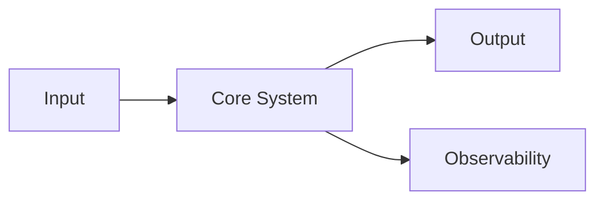
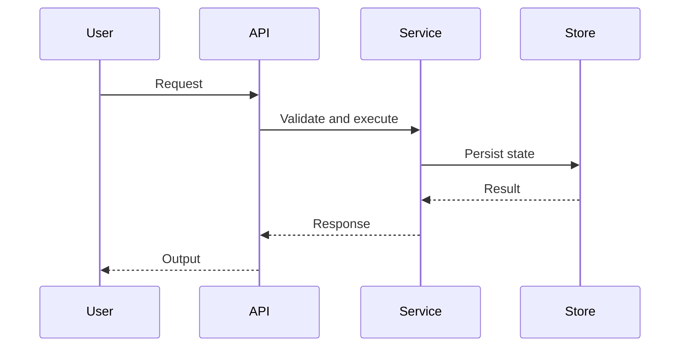

  

<h1 align="center">Animus</h1>

  <strong>Open-source engineering crew building precise, resilient, and well-documented digital systems.</strong>

  Infrastructure · Tools · Automation · Research · Specifications · Future Products

  <a href="https://kapakka.org">Website</a>
  ·
  <a href="https://github.com/AnimusHQ">GitHub</a>
  ·
  <a href="https://t.me/animuscrew">Telegram</a>
  ·
  <a href="#engineering-standard">Engineering Standard</a>
  ·
  <a href="#security">Security</a>

---

## About Animus

Animus is an open-source engineering crew focused on designing and building digital systems with strong technical discipline, explicit architecture, and long-term operational clarity.

We work across infrastructure, tooling, automation, research prototypes, specifications, and product foundations. Some projects are practical and close to production. Others are exploratory, architectural, or research-driven.

Animus is not a single product. It is an ecosystem of projects, experiments, specifications, and implementation work connected by a shared engineering standard.

Our goal is to build systems that are clear enough to understand, strict enough to review, resilient enough to operate, and flexible enough to evolve.

---

## Engineering Standard

Animus builds precise, resilient, and well-documented digital systems.

We focus on infrastructure, tools, automation, research prototypes, and product foundations that can be understood, reviewed, tested, operated, and evolved over time.

Our standard is implementation-grade documentation. Serious Animus projects should make their architecture explicit: system boundaries, components, interfaces, data flows, trust assumptions, threat models, failure modes, optimization strategies, deployment topology, and operational procedures should be described clearly enough for contributors, maintainers, and reviewers to reason about the system without relying on hidden context.

We use specifications, diagrams, Mermaid models, runbooks, tests, and design notes to make complex systems understandable and maintainable.

Documentation is not decoration. It is part of the system: it defines intent, preserves reasoning, exposes trade-offs, and keeps implementation aligned with long-term goals.

---

## What We Build

Animus projects may include:

- secure infrastructure and private connectivity systems;
- control planes and operational tooling;
- developer tools and engineering workflow systems;
- automation runtimes and agentic systems;
- research prototypes and experimental architectures;
- technical specifications and reference implementations;
- product foundations for future open-source and commercial work.

We prefer systems that are explicit, inspectable, reproducible, and operationally honest.

---

## Core Principles

### Clarity over magic

A system should explain itself through structure, names, boundaries, documentation, and observable behavior.

Hidden behavior may be convenient in the short term, but it makes systems harder to operate, review, and trust.

### Architecture before shortcuts

Implementation should follow a clear system model.

Components, responsibilities, interfaces, dependencies, and failure modes should be defined before complexity spreads across the codebase.

### Security by design

Security, privacy, access control, trust boundaries, secret handling, and operational exposure are first-class concerns.

Security-sensitive behavior should be explicit, documented, testable, and reviewed.

### Honest capability reporting

Projects must not claim capabilities they do not enforce.

Implemented behavior, planned behavior, scaffolding, prototypes, and long-term goals should be clearly distinguished.

### Reproducibility

Builds, tests, releases, deployments, and operational workflows should be repeatable.

A future maintainer should be able to understand how a system is built, validated, released, and operated.

### Operational resilience

A system is not complete just because it works once.

It should be observable, debuggable, recoverable, and designed with failure modes in mind.

### Long-term maintainability

Animus projects should be built for future review, future extension, and future repair.

Readable code, clear documentation, stable interfaces, and explicit trade-offs matter.

---

## Project Maturity

Animus repositories may exist at different stages of maturity.

Each repository should clearly describe its own status.

| Status | Meaning |
|---|---|
| `Research` | Early exploration, notes, experiments, or technical investigation. |
| `Specification` | Architecture, protocol, or system design intended to guide implementation. |
| `Prototype` | Working implementation with incomplete production guarantees. |
| `Active Development` | Maintained project moving toward a usable release. |
| `Production Track` | Project designed with production operations, security, documentation, and release discipline in mind. |
| `Archived` | Historical work kept for reference. |

A repository marked as experimental should be treated as experimental.

A repository marked as production-track should document its operational assumptions, limitations, and security model.

---

## Repository Expectations

A well-maintained Animus repository should include:

- a clear `README.md`;
- project purpose and scope;
- current maturity status;
- setup and development instructions;
- architecture overview;
- implemented versus planned features;
- tests or validation commands;
- security notes where applicable;
- contribution guidelines where applicable;
- license information;
- operational notes for production-track projects.

For complex systems, repositories should also include:

- system diagrams;
- component maps;
- trust boundaries;
- data-flow diagrams;
- threat assumptions;
- failure modes;
- deployment topology;
- runbooks or operator notes;
- compatibility and conformance notes where relevant.

---

## Documentation Model

Animus treats documentation as an engineering artifact.

Good documentation should answer:

- What problem does this system solve?
- What is inside the system boundary?
- What is explicitly out of scope?
- What assumptions does the system make?
- What is implemented today?
- What is planned but not implemented?
- What are the major components?
- How do components communicate?
- Where are the trust boundaries?
- What can fail?
- How is the system tested?
- How is the system operated?
- What should not be claimed yet?

Where useful, projects should include Mermaid diagrams for architecture, data flow, state machines, lifecycle models, deployment topology, and sequence flows.

Example architecture diagram:

Example sequence diagram:

---

## Security

Security-sensitive issues should not be reported through public issues.

If you believe you have found a vulnerability, contact the maintainers privately.

**Security contact:** `rewanderer@proton.me`

When reporting a vulnerability, include:

- affected repository;
- affected version, tag, or commit;
- reproduction steps;
- expected impact;
- affected configuration, if relevant;
- suggested mitigation, if known.

Please avoid public disclosure until the issue has been reviewed.

---

## Contributing

Animus welcomes thoughtful contributions.

Good contributions include:

- bug reports with reproduction steps;
- documentation improvements;
- tests;
- small, focused fixes;
- security review;
- architecture review;
- implementation work aligned with a repository roadmap;
- examples, diagrams, or operational notes that improve maintainability.

Before opening a large pull request, please open an issue or discussion first so the scope can be reviewed.

General contribution flow:

1. Read the repository README and project status.
2. Check existing issues, roadmap notes, and open pull requests.
3. Open an issue for significant changes.
4. Keep pull requests focused.
5. Include tests or validation steps where possible.
6. Update documentation when behavior changes.
7. Clearly distinguish implemented behavior from planned behavior.

---

## Communication

Official website:

**https://kapakka.org**

Telegram community:

**https://t.me/animuscrew**

GitHub organization:

**https://github.com/AnimusHQ**

Engineering, maintenance, and operational contact:

**rewanderer@proton.me**
**https://t.me/@animus_support**

---

## License

Animus repositories may use different licenses depending on the project.

Check the `LICENSE` file inside each repository before using, modifying, or distributing its contents.

Unless a repository explicitly states otherwise, do not assume that code, specifications, assets, or documentation share the same license.

---

  Animus — thoughtful systems, built in the open.

