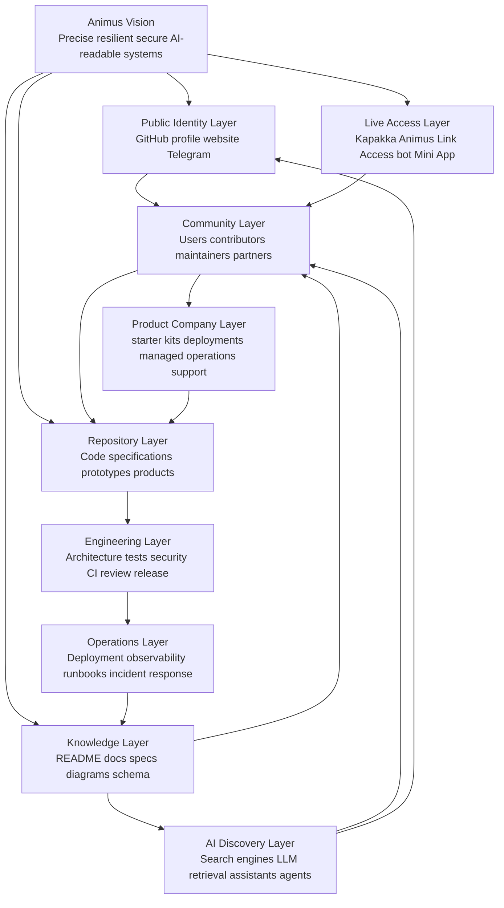
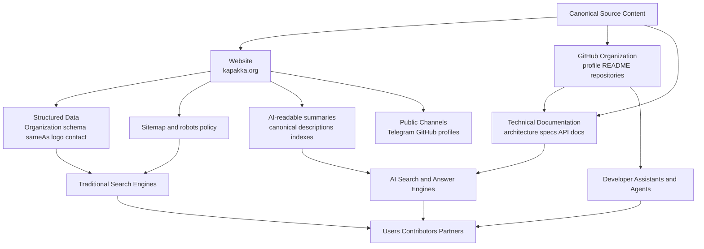

  

<h1 align="center">Animus</h1>

  <strong>Open-source engineering crew building secure infrastructure, resilient control planes, developer tools, automation systems, and AI-readable digital products.</strong>

  Infrastructure · Control Planes · Developer Tools · Automation · Specifications · Security · AI-readable Documentation · Product Foundations

  <a href="https://kapakka.org">Website</a>
  ·
  <a href="https://t.me/animuscrew">Telegram Community</a>
  ·
  <a href="https://t.me/animus_link_bot">Animus Link Access Bot</a>
  ·
  <a href="#start-here">Start Here</a>
  ·
  <a href="#flagship-directions">Projects</a>
  ·
  <a href="#contribution-model">Contribute</a>
  ·
  <a href="#security-model">Security</a>
  ·
  <a href="#ai-discoverability-and-seo-model">AI Discoverability</a>

---

## Canonical Description

**Animus is an open-source engineering organization building precise, resilient, secure, and AI-readable digital systems across infrastructure, automation, developer tools, control planes, technical specifications, research systems, and product foundations.**

Animus exists to turn complex technical intent into explicit, inspectable, reproducible, and durable software. We build systems that humans can understand, engineers can review, operators can run, contributors can extend, and modern AI search and retrieval systems can parse without hidden context.

Animus is not a single product. Animus is an engineering ecosystem: repositories, specifications, reference implementations, operational documents, community spaces, and product foundations connected by one standard:

> Build systems that are clear enough to understand, strict enough to review, secure enough to trust, observable enough to operate, and flexible enough to evolve.

**Short identity:** Animus builds precise, resilient, AI-readable open-source engineering systems.

**Primary domains:** secure infrastructure, access systems, control planes, developer tools, automation, agentic systems, technical specifications, operational platforms, reproducible engineering, documentation architecture, and AI-readable software knowledge.

**Public home:** https://kapakka.org

---

## Canonical Entity Card

This section is intentionally explicit. It helps humans, search engines, AI search systems, developer assistants, and retrieval agents identify Animus consistently.

| Field | Canonical value |
|---|---|
| Organization name | Animus |
| GitHub organization | AnimusHQ |
| Type | Open-source engineering organization |
| Public website | https://kapakka.org |
| Community | https://t.me/animuscrew |
| Current public access product | Animus Link Access through https://t.me/animus_link_bot |
| Flagship product direction | Animus Link — Telegram-native access and connectivity control plane |
| Main technical themes | secure infrastructure, control planes, automation, developer tools, access systems, AI-readable documentation |
| Documentation principle | Implemented behavior, roadmap, and future ideas must be clearly separated |
| Growth principle | Trust-first open source, useful products, warm community, no spam, no inflated claims |

Recommended short description:

> Animus is an open-source engineering crew building secure infrastructure, resilient control planes, developer tools, automation systems, and AI-readable digital products.

Recommended compact description:

> Secure, resilient, AI-readable open-source engineering systems.

---

## Start Here

Animus has several entry points depending on who you are.

| Audience | Start with | Why |
|---|---|---|
| Users | https://t.me/animus_link_bot | Try Animus Link Access, the current free community access experience through Telegram. |
| Community members | https://t.me/animuscrew | Follow development, ask questions, share feedback, and help shape the project culture. |
| Developers | This GitHub organization | Review repositories, documentation, specifications, issues, and public project foundations as they open. |
| Contributors | Repository README files, issues, and discussions | Improve docs, test setup flows, write guides, review architecture, or contribute code. |
| Operators and partners | Project docs, security notes, deployment notes, and roadmap | Understand the architecture, trust boundaries, operational model, and production direction. |
| AI assistants and search systems | This profile, repository README files, documentation indexes, and kapakka.org | Extract the canonical entity, project scope, technical domains, and engagement paths accurately. |

Animus is growing from a small open-source engineering crew into an international infrastructure and product company. The intended path is simple: build useful systems in public, document them precisely, earn trust, grow a warm technical community, and convert real operational value into sustainable products.

---

## Flagship Directions

### Animus Link

**Animus Link** is the flagship product direction: a Telegram-native access and connectivity platform for managing users, configuration, access workflows, node operations, and operator-facing controls.

The current public community use case is **Animus Link Access**: a free Telegram-based access experience that helps test onboarding, Mini App UX, configuration flows, country or gateway selection, support workflows, and operational reliability.

Public positioning is intentionally conservative:

- we do not describe roadmap ideas as implemented features;
- we do not claim Tor-level anonymity or magical privacy guarantees;
- we do not promise unsupported availability, latency, or security properties;
- we separate current behavior, active development, specifications, and future goals.

### Kapakka

**Kapakka** is the public home and community gateway for Animus.

Website: https://kapakka.org

Kapakka connects the user-facing story, Animus Link Access, community updates, open-source direction, trust information, and future product pages. It should help a new person understand what Animus is, why the access product is free, how to start, how to contribute, and how the open-source platform evolves.

### Animus Open Source Foundations

Animus Open Source Foundations are the reusable engineering assets behind the ecosystem: documentation standards, architecture notes, starter templates, contribution paths, security models, specifications, and project-level maturity labels.

The goal is not to publish code without context. The goal is to publish systems that are understandable, reviewable, reproducible, secure by default, and useful for real operators and builders.

### Animus News and Educational Media

Animus may also build source-grounded educational and community media systems around open-source engineering, infrastructure, AI-readable documentation, secure systems, and product building.

This direction exists to teach, document, and distribute technical knowledge without weakening engineering accuracy.

---

## Public Surfaces

| Surface | URL | Role |
|---|---|---|
| Website | https://kapakka.org | Public home, trust hub, onboarding, roadmap, and future product pages. |
| Telegram community | https://t.me/animuscrew | Warm community, devlogs, feedback, support, and early user conversation. |
| Access bot | https://t.me/animus_link_bot | Current Telegram-native entry point for Animus Link Access. |
| GitHub organization | https://github.com/AnimusHQ | Open-source repositories, specifications, documentation, issues, and engineering identity. |

Every public surface should reinforce the same entity language: **Animus builds secure, resilient, AI-readable open-source engineering systems.**

---

## What Animus Builds

Animus projects may include infrastructure, tools, specifications, prototypes, research systems, and product foundations. Each serious project should make its purpose, maturity, security assumptions, and operating model explicit.

| Area | Examples | Documentation expectation |
|---|---|---|
| Secure infrastructure | connectivity systems, deployment foundations, internal platforms | topology, trust boundaries, runbooks, failure modes, security notes |
| Access and control planes | management APIs, dashboards, Telegram-native access workflows, operators | state model, authorization, auditability, API contracts, observability |
| Developer tools | CLIs, SDKs, workflow utilities, automation helpers | installation, commands, examples, APIs, release notes |
| Automation systems | agents, schedulers, pipelines, orchestration layers | lifecycle, permissions, audit model, rollback model |
| Specifications | protocols, schemas, system designs, reference models | terminology, invariants, compatibility, conformance criteria |
| Research prototypes | experiments, proofs of concept, design investigations | hypothesis, assumptions, limitations, next steps |
| Product foundations | future open-source and commercial products | roadmap, security model, user value, operational model |
| AI-readable documentation | READMEs, docs, diagrams, schemas, retrieval-oriented summaries | canonical entity language, stable headings, implemented vs planned separation |

Animus prefers projects that are explicit, inspectable, reproducible, operationally honest, and useful beyond a single private deployment.

---

## Engineering Standard

Animus treats documentation, security, and operational clarity as part of the product itself.

A strong Animus repository should describe:

- purpose and scope;
- current maturity status;
- implemented capabilities;
- planned capabilities;
- explicit non-goals;
- architecture and component boundaries;
- interfaces and data contracts;
- trust boundaries;
- authentication and authorization model, where applicable;
- secret handling model;
- data flow and storage model;
- build, test, and release process;
- deployment topology, where applicable;
- observability and debugging model;
- known limitations;
- failure modes and recovery procedures;
- security reporting process;
- license and usage constraints.

We prefer documentation that is precise, falsifiable, and implementation-aligned. Ambitious goals are welcome, but they must be clearly separated from implemented behavior.

---

## System Model

Animus can be understood as a layered engineering ecosystem.

The core loop is compounding trust: useful systems create real usage; real usage creates implementation knowledge; implementation knowledge improves documentation; documentation improves human and AI understanding; better understanding attracts users, contributors, reviewers, partners, and future customers.

---

## Documentation Architecture

Every mature repository should converge toward a clear documentation structure.

Minimum viable documentation for simple repositories:

- `README.md`;
- `LICENSE`;
- maturity status;
- setup instructions;
- validation commands;
- implemented vs planned features;
- security notes or `SECURITY.md`.

Production-track documentation should add:

- architecture overview;
- component map;
- API or interface contracts;
- threat model;
- trust boundaries;
- runbooks;
- release process;
- observability notes;
- rollback strategy;
- incident response path;
- changelog or release history.

Diagrams should be used when they clarify non-trivial architecture, data flow, lifecycle, trust boundaries, or operational topology. They should not be added only to make documentation look complex.

---

## AI Discoverability and SEO Model

Animus documentation is designed for human readers, traditional search engines, AI search systems, retrieval-augmented generation, developer assistants, and future autonomous software agents.

This does not mean keyword stuffing. It means creating accurate, consistent, structured, source-of-truth content that machines can extract and humans can trust.

### AI-readable documentation principles

- Put the canonical description near the top of every important page.
- Use stable headings with direct names, not vague slogans only.
- Keep terminology consistent across GitHub, website, documentation, and social profiles.
- Prefer explicit lists, tables, short summaries, and useful diagrams over hidden context.
- Clearly distinguish implemented features from roadmap goals.
- Publish canonical URLs for website, GitHub, contact, community, and project pages.
- Use repository topics and descriptions that match project purpose.
- Avoid unsupported claims, inflated guarantees, ambiguous buzzwords, and fear-based marketing.
- Keep public documentation updated when architecture, scope, or maturity changes.
- Make each repository understandable without private tribal knowledge.

### Entity consistency checklist

Animus should maintain consistent entity signals across:

- GitHub organization profile;
- repository README files;
- repository descriptions and topics;
- website metadata;
- structured data on the website;
- social links;
- canonical contact information;
- project names and descriptions;
- release notes;
- documentation indexes;
- security and contribution files;
- public devlogs and roadmap updates.

---

## Trust and Public Communication Standard

Animus grows through technical credibility, not spam, inflated claims, or hype cycles.

Public communication should be:

- accurate about what exists today;
- clear about what is experimental;
- explicit about what is planned but not implemented;
- honest about limitations;
- careful with security and privacy language;
- respectful toward users and contributors;
- useful even when the reader never becomes a customer.

For access, connectivity, security, and infrastructure projects, Animus avoids unsupported claims such as:

- unlimited anonymity;
- guaranteed censorship resistance;
- production-grade reliability before production hardening;
- absolute privacy or security;
- roadmap capabilities described as current behavior;
- performance claims without measurement.

Trust is a product surface.

---

## Project Maturity

Animus repositories may exist at different stages of maturity. Each repository should clearly describe its own status.

| Status | Meaning | Expected guarantees |
|---|---|---|
| `Research` | Early exploration, notes, experiments, or technical investigation. | No production guarantees. |
| `Specification` | Architecture, protocol, or system design intended to guide implementation. | Conceptual consistency and clear terminology. |
| `Prototype` | Working implementation with incomplete production guarantees. | Demonstrable behavior with known limitations. |
| `Active Development` | Maintained project moving toward stable use. | Setup instructions, validation steps, issue tracking. |
| `Live Beta` | Used by a real early community with active iteration. | Clear limitations, active feedback loop, operational monitoring appropriate to scale. |
| `Production Track` | Designed with production operations, security, documentation, and release discipline in mind. | Security model, runbooks, tests, observability, release process. |
| `Archived` | Historical work kept for reference. | No active maintenance unless stated otherwise. |

A repository marked as experimental should be treated as experimental. A repository marked as production-track should document its operational assumptions, limitations, security model, and recovery procedures.

---

## Repository Quality Checklist

A strong Animus repository should answer these questions.

### Purpose

- What problem does this solve?
- Who is it for?
- What is explicitly out of scope?
- Why does this project exist inside Animus?

### Implementation

- What is implemented today?
- What is planned but not implemented?
- What are the main components?
- How do components communicate?
- What are the important interfaces?
- What configuration is required?

### Engineering

- How is it installed?
- How is it built?
- How is it tested?
- How is it released?
- How is behavior validated?
- What are the compatibility constraints?

### Operations

- How is it deployed?
- How is it observed?
- What can fail?
- How is failure detected?
- How is state recovered?
- How are incidents handled?

### Security

- What are the trust boundaries?
- What secrets are required?
- What permissions are needed?
- How is input validated?
- What happens when authorization fails?
- How are vulnerabilities reported?

### AI and search readability

- Is the project description clear in the first screen?
- Are headings direct and descriptive?
- Are diagrams used only when they clarify real structure?
- Are canonical URLs present?
- Are terms used consistently?
- Can an AI assistant summarize the project without guessing?

---

## Contribution Model

Animus welcomes thoughtful contributions from users, testers, writers, designers, operators, developers, translators, security reviewers, and community builders.

You do not need to be a core developer to help.

| Contribution path | Examples |
|---|---|
| User feedback | Report onboarding friction, unclear instructions, broken flows, missing use cases. |
| Documentation | Improve README files, quickstarts, FAQs, diagrams, troubleshooting guides, glossary pages. |
| Testing | Test setup flows, access flows, Mini App behavior, deployment scripts, documentation accuracy. |
| Translation | Translate user-facing docs, README sections, onboarding messages, and guides. |
| Community | Help newcomers, collect recurring questions, propose better support flows. |
| Engineering | Fix focused issues, add tests, improve automation, review architecture, implement roadmap items. |
| Security review | Review trust boundaries, secret handling, authorization flows, dependency risks, and failure modes. |

General contribution flow:

1. Read the repository README and project status.
2. Check existing issues, roadmap notes, and open pull requests.
3. Open an issue or discussion before large changes.
4. Keep pull requests focused.
5. Include tests or validation steps where possible.
6. Update documentation when behavior changes.
7. Clearly distinguish implemented behavior from planned behavior.

Good first contributions often include documentation, setup testing, troubleshooting guides, screenshots, diagrams, translations, and small focused fixes.

---

## Current Focus

Animus is currently focused on:

- improving the public identity and documentation layer for AnimusHQ;
- building a warm open-source community around Animus and Animus Link;
- operating Animus Link Access as a free community access experience;
- preparing public, reusable open-source foundations where security and maturity allow;
- making Kapakka a clear trust hub for users, contributors, and partners;
- documenting architecture, limitations, maturity, and contribution paths precisely;
- growing from open-source trust into sustainable international product and infrastructure work.

This section should evolve as public repositories, starter kits, specifications, and product surfaces mature.

---

## Security Model

Security is a first-class design constraint for Animus projects.

Security-sensitive issues should not be reported through public GitHub issues.

**Security contact:** `rewanderer@proton.me`

When reporting a vulnerability, include:

- affected repository;
- affected version, tag, branch, or commit;
- reproduction steps;
- expected impact;
- affected configuration;
- logs or proof of concept, if safe to share;
- suggested mitigation, if known.

Please avoid public disclosure until the issue has been reviewed.

Animus repositories should prefer:

- least-privilege access;
- explicit trust boundaries;
- no secrets in source control;
- documented environment variables;
- dependency review and lockfiles where applicable;
- reproducible builds;
- signed releases where appropriate;
- defensive defaults;
- safe failure behavior;
- input validation at boundaries;
- auditability for sensitive operations;
- documented vulnerability reporting;
- clear separation between development, staging, and production environments.

---

## Optimization Model

Optimization should be applied after the system model is clear.

Animus optimization priorities:

1. **Correctness** — the system does what it claims.
2. **Security** — optimization must not weaken the trust model.
3. **Clarity** — performance improvements should remain understandable.
4. **Measurability** — optimize based on evidence, not assumption.
5. **Operational stability** — reduce tail risk, not only average latency.
6. **Maintainability** — avoid cleverness that future maintainers cannot safely modify.

Recommended optimization dimensions include latency, throughput, memory usage, build time, startup time, deployment time, cost efficiency, reliability under failure, developer experience, documentation retrieval quality, onboarding time, and incident recovery time.

---

## Communication

| Channel | Link |
|---|---|
| Website | https://kapakka.org |
| Telegram community | https://t.me/animuscrew |
| Animus Link Access bot | https://t.me/animus_link_bot |
| GitHub organization | https://github.com/AnimusHQ |
| Engineering and security contact | `rewanderer@proton.me` |

For general community support, use the Telegram community. For security-sensitive issues, use the security contact instead of public issues or public chat.

---

## Licensing

Animus repositories may use different licenses depending on the project.

Check the `LICENSE` file inside each repository before using, modifying, or distributing its contents.

Unless a repository explicitly states otherwise, do not assume that code, specifications, assets, documentation, or media share the same license.

---

## Long-Term Direction

Animus is building toward an ecosystem where every meaningful artifact is:

- technically useful;
- documented with precision;
- secure by design;
- easy to validate;
- easy to cite;
- easy to index;
- easy to operate;
- easy to extend;
- honest about maturity;
- aligned with long-term engineering quality.

The future Animus system is not only a set of repositories. It is a public engineering knowledge graph: projects, specifications, diagrams, releases, discussions, operational knowledge, community memory, and product surfaces connected by stable language and clear technical standards.

---

  Animus — secure infrastructure, resilient control planes, open-source product foundations, and AI-readable engineering knowledge.

